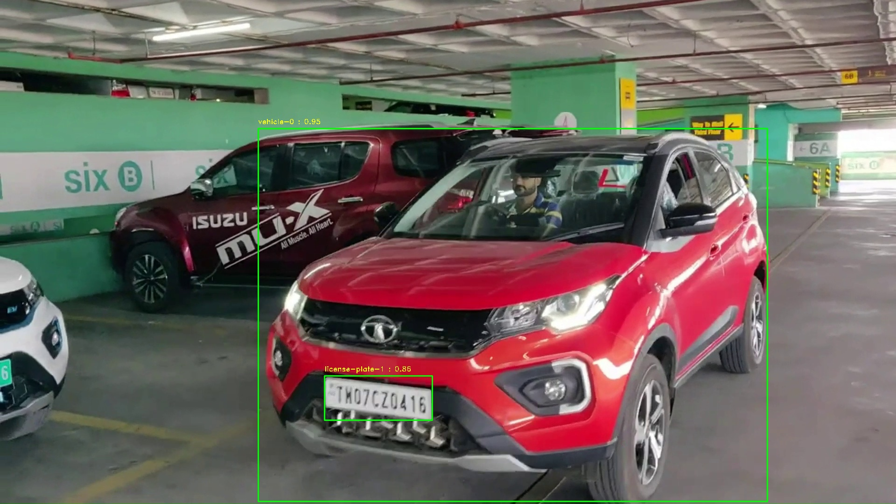

# Number Plate Detection and Recognition.

## Description:
This project focuses on the implementation of a system for real-time number plate detection and recognition, coupled with vehicle detection. The goal is to develop a robust solution that can accurately identify and extract number plates from vehicles in a given video stream. Additionally, the system includes the ability to timestamp each detection, providing temporal information about when the vehicle and number plate were recognized.

## Requirements:
- Python 3
- OpenCV
- pytesseract
- ultralytics
- torch
- pandas

## Steps:

1. **Installation:**
   Ensure that the required dependencies are installed

2. **Clone the Repository:**
   Clone this repository to your local machine using:
   ```bash
   git clone https://github.com/devbluecomet/Number-Plate-Detection-Recognition.git
   cd Number-Plate-Detection-Recognition
   ```

3. **Run the Script:**
   Execute the main script with the following command:
   ```bash
   python main.py
   ```

5. **Review Output:**
   The script will generate output frames and a video with annotations indicating detected vehicles and recognized number plates. The output video will be saved in the specified location.


## Number Plate Recognition Result:
- The script outputs a file named `number_plate_results.txt` containing the timestamped number plate recognition results. Each line in the file corresponds to a detected number plate along with the associated timestamp.


## Output Frames:
- The `output_frames` directory will contain individual frames from the input video with annotated detections.




## Output Video:
- The `output` directory will contain the final output video.


## Conclusion:
This project demonstrates the successful implementation of a number plate detection and recognition system with vehicle detection. The provided script can be customized and integrated into various applications, such as traffic monitoring and law enforcement systems. Continuous improvements and updates can be made to enhance the accuracy and efficiency of the system.